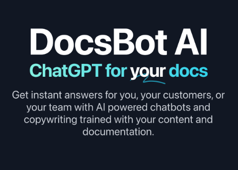
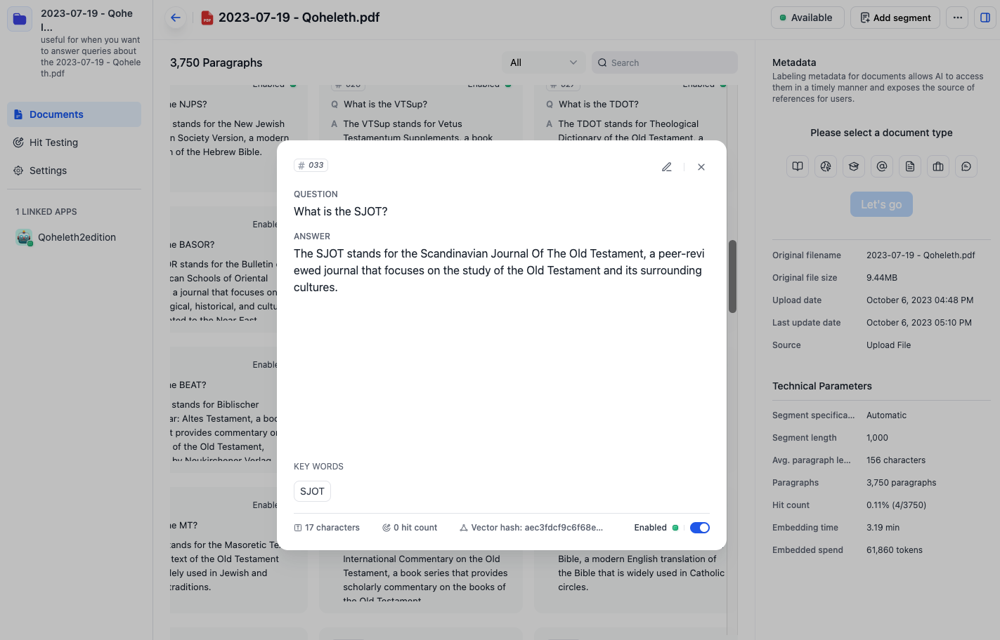

# ChatGPT Applications

====================

*Jack Jianfeng Xia*
*11 Oct 2023*
HSUHK ITSC ADT

---

## Introduction

- How do I "train" a model based on my content?
- How do I let ChatGPT know about things that happened after 2021?
- How do I prevent ChatGPT from babbling nonsense with users?

### ChatGPT for your Documentation
1. ChatGPT need: 
   - Learn (Prepare) the Knowledge (Dataset) 
2. Then, ChatGPT will: 
   - Find information from your docs, and give the answer

---

## Requirements - Support portal (REG, ITSC, SAO, HRO, etc.)

AI assistant to solve HSU Administrative & Support related questions for Officers and Students
- To allow staff create an ChatBot for the department or programme
- To allow staff update the documentation and set prompt
- To allow staff add a chat app to the bottom right of the office website
- To allow staff view logs and improve the performance of ChatBot
- To allow user chat with the ChatBot

---

## Technology we need
1. Azure OpenAI Service
2. Embedding Model: Azure OpenAI Text-Embedding-Ada-002
3. Vector Databases: Long-Term Memory for ChatGPT
4. LangChain: Agents and Semantic search in datasets
5. ChatGPT prompts with results from search

---

## Prepare the Dataset for ChatGPT
1. Prepare your documentation: 
   - Clean up and organize docs 
   - Chunk it into Paragraphs
2. Help ChatGPT to understand:
   - Turning words into Numbers
   - By Embbedding Model (Text-Embedding-Ada-002)
3. Remember (Long-Term Memory)
   - Vector Databases
   - LangChain

---

## Chat with your documentation

1. Start a conversation, get keywords for searching
2. Searching with content in the vector Dataset 
3. Get best results and convert vector to text
4. Prompt with search results from the vector Dataset
5. Send the prompt to the ChatGPT and get the answer

---

## Vector Database 

|Database|Pros|Cons|
|---|---|---|
|Weaviate|Supports semantic search and knowledge graphs. Automatically extracts entities and relationships from text data.|Require additional effort for setup and configuration|
|Pinecone|Efficiently stores, indexes, and searches high-dimensional vectors. Real-time searching. |Cloud-based (potential cost implications)|
|Chroma|Fast and scalable vector database. Popular for research and experimentation.|Requires more dev and maintenance effort|
---

## Weaviate 

  - semantic search,
  - similarity search,
  - automated data harmonization,
  - anomaly detection,
  - data classification

---

## Python Libraries

